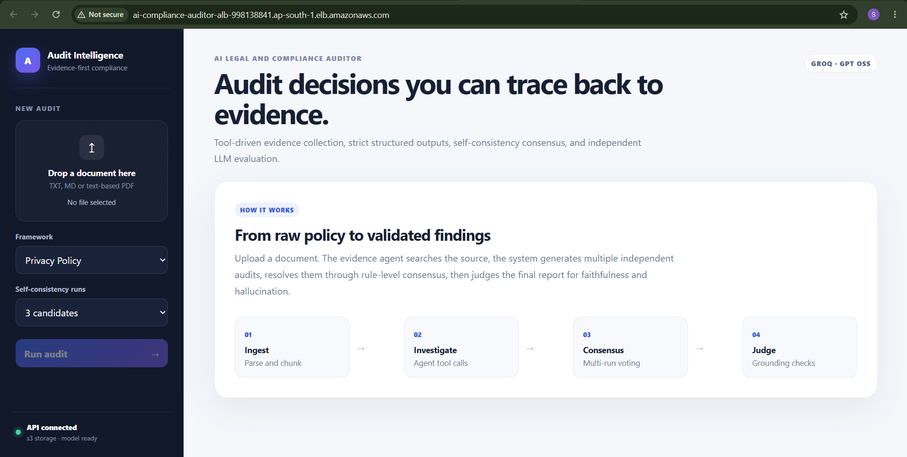

# AI Legal & Compliance Auditor

AI audit pipeline that reads regulatory or policy documents, uses a tool-using agent to gather evidence, generates three schema-constrained audit candidates, applies self-consistency voting, and evaluates the final report for faithfulness and hallucination risk.


## Architecture

```text
Raw Document
    |
    v
Document Parser + Chunk Index
    |
    v
ReAct-style Evidence Agent
    |-- search_document
    |-- get_chunk
    `-- lookup_definition
    |
    v
Evidence Bundle
    |
    +--> Structured Audit Candidate 1
    +--> Structured Audit Candidate 2
    `--> Structured Audit Candidate 3
                    |
                    v
         Self-Consistency Consensus
                    |
                    v
         Strict Pydantic JSON Report
                    |
                    v
              LLM-as-a-Judge
                    |
                    v
 Faithfulness | Completeness | Hallucination Rate

Golden Dataset
    |
    v
Precision | Recall | F1
```

The implementation deliberately does not expose private chain-of-thought. The agent records an auditable action trace containing the tool name, arguments, declared evidence purpose, and a result preview.

## Features

- FastAPI REST API
- PDF, TXT, and Markdown ingestion
- BM25 document search
- ReAct-style iterative tool use
- Groq-compatible OpenAI SDK tool calling
- Strict Pydantic structured outputs
- Three-run self-consistency voting
- LLM-as-a-Judge evaluation
- Precision, recall, and F1 evaluation on golden cases
- Local filesystem storage for development
- Amazon S3 persistence for AWS deployment
- Docker and Docker Compose
- Pytest
- GitHub Actions CI
- Terraform deployment to Amazon ECS Fargate
- Application Load Balancer
- AWS Secrets Manager integration
- CloudWatch Logs

## End-to-End Project Status

This project demonstrates an evidence-first AI Legal and Compliance Auditor with:

- FastAPI backend
- Frontend audit dashboard
- Document upload and parsing
- Local BM25 evidence retrieval
- Tool-driven evidence collection
- Structured audit generation
- Self-consistency consensus
- Independent LLM-as-Judge evaluation
- Dockerized deployment
- GitHub Actions CI
- Terraform Infrastructure as Code
- AWS ECS Fargate deployment
- Amazon ECR image registry
- Application Load Balancer
- Amazon S3 document/audit storage
- AWS Secrets Manager for Groq API key
- CloudWatch logging

The application has been deployed on AWS ECS Fargate and the frontend and `/health` endpoint were successfully verified.

Current runtime status:

- Frontend: Working
- `/health`: Working
- Storage backend: S3
- Model provider: Groq-compatible OpenAI SDK endpoint
- Full long-running audit execution: requires async job handling for production-grade cloud use

## Project Structure

```text
ai_legal_compliance_auditor/
├── app/
│   ├── agent.py
│   ├── config.py
│   ├── consensus.py
│   ├── document_parser.py
│   ├── frameworks.py
│   ├── judge.py
│   ├── llm.py
│   ├── main.py
│   ├── metrics.py
│   ├── orchestrator.py
│   ├── schemas.py
│   ├── search_index.py
│   ├── storage.py
│   └── tools.py
├── eval/
│   └── golden_cases.json
├── infra/
│   └── terraform/
├── sample_docs/
├── scripts/
├── tests/
├── .env.example
├── Dockerfile
├── docker-compose.yml
├── requirements.txt
└── requirements-dev.txt
```

## Included Framework Catalogs

The project includes compact demonstration catalogs for:

- privacy policies
- terms of service
- financial disclosure documents

These catalogs demonstrate the architecture and evaluation workflow. They are not a substitute for jurisdiction-specific legal requirements.

## Known Production Limitation

The current `/audits` endpoint runs the full audit synchronously:

1. Evidence collection
2. Multi-candidate audit generation
3. Consensus
4. Independent judge evaluation
5. Audit persistence

This works for local testing and controlled demos, but long-running cloud execution should be moved to an asynchronous job architecture.

Recommended production upgrade:

- `POST /audits` returns `202 Accepted` with a `job_id`
- Background worker performs audit execution
- `GET /jobs/{job_id}` returns status and progress
- Frontend polls job status or uses Server-Sent Events
- Completed audit is fetched by `audit_id`

This avoids ALB/browser timeout issues and makes the system production-ready for larger documents and multi-step reasoning flows.

## Local Setup

### 1. Create a virtual environment

```bash
python -m venv .venv
```

Windows PowerShell:

```powershell
.venv\Scripts\Activate.ps1
```

macOS/Linux:

```bash
source .venv/bin/activate
```

### 2. Install dependencies

```bash
pip install -r requirements-dev.txt
```

### 3. Configure environment

Windows:

```powershell
Copy-Item .env.example .env
```

macOS/Linux:

```bash
cp .env.example .env
```

Set:

```text
GROQ_API_KEY=your_groq_key
GROQ_MODEL=openai/gpt-oss-20b
GROQ_BASE_URL=https://api.groq.com/openai/v1

STORAGE_BACKEND=local
LOCAL_DATA_DIR=data
```

### 4. Start the API

```bash
uvicorn app.main_with_ui:app --reload --port 8000
```
Open the frontend:

```text
http://127.0.0.1:8000/

Swagger UI:

```text
http://127.0.0.1:8000/docs
```

## Docker

```bash
docker compose up --build
```

## API Flow

### 1. Upload a document

```bash
curl -X POST "http://127.0.0.1:8000/documents"   -F "file=@sample_docs/privacy_policy_acme.txt"
```

### 2. Run an audit

```bash
curl -X POST "http://127.0.0.1:8000/audits"   -H "Content-Type: application/json"   -d '{
    "document_id": "REPLACE_ME",
    "framework": "privacy",
    "runs": 3
  }'
```

## AWS Deployment

The application is containerized and deployed on AWS using:

- Docker
- Amazon ECR
- ECS Fargate
- Application Load Balancer
- S3 for document/audit storage
- Secrets Manager for Groq API key
- CloudWatch Logs
- Terraform Infrastructure as Code

Health check:

`GET /health`

Runtime storage backend:

`s3`
The response contains:

- final consensus report
- consensus agreement score
- tool action trace
- judge scores
- unsupported finding IDs
- candidate count

### 3. Read a saved audit

```text
GET /audits/{audit_id}
```

### 4. Health check

```text
GET /health
```

## Self-Consistency Strategy

Each audit uses one evidence-gathering agent pass followed by three independent structured extraction passes.

Consensus is computed per rule ID:

1. collect candidate statuses
2. choose the majority status
3. select the strongest matching finding
4. use majority risk rating
5. calculate agreement ratio

The consensus layer is deterministic and unit tested.

## Evaluation

Run:

```bash
python scripts/run_eval.py
```

The golden dataset is stored in:

```text
eval/golden_cases.json
```

The evaluation calculates:

```text
Precision
Recall
F1
```

The predicted positive set is the set of rule IDs classified as `non_compliant`.

A separate LLM judge scores:

```text
faithfulness
completeness
hallucination_rate
unsupported_finding_ids
fabricated_claims
```

## Prompt Engineering Concepts Demonstrated

| Concept | Implementation |
|---|---|
| Zero-shot prompting | Framework-based audit instructions |
| ReAct | Iterative evidence tool loop |
| Tool calling | Search, exact chunk read, glossary lookup |
| Function calling | OpenAI Responses API tools |
| Structured output | Pydantic `AuditReport` and `JudgeResult` |
| Self-consistency | Three candidates plus majority consensus |
| Meta prompting | Framework rules inserted dynamically |
| LLM-as-a-Judge | Separate source-grounded evaluation pass |

## AWS Deployment

The Terraform stack provisions:

```text
ECR
  |
  v
ECS Fargate Service
  |
  v
Application Load Balancer
  |
  v
Public API

S3
  |
  +-- documents
  `-- audit results

Secrets Manager
  |
  `-- GROQ_API_KEY

CloudWatch Logs
```

### Prerequisites

- AWS CLI authenticated
- Terraform installed
- Docker installed
- an AWS account with permissions for ECR, ECS, IAM, EC2 load balancing, S3, CloudWatch Logs, and Secrets Manager

### PowerShell deployment

```powershell
$env:GROQ_API_KEY="your-groq-key"
.\scripts\deploy_aws.ps1
```

### macOS/Linux deployment

```bash
export GROQ_API_KEY="your-groq-key"
chmod +x scripts/deploy_aws.sh
./scripts/deploy_aws.sh
```

The deployment scripts:

1. initialize Terraform
2. create ECR and the Secrets Manager secret metadata
3. write the API key to Secrets Manager
4. build the Docker image
5. push the image to ECR
6. deploy ECS Fargate, ALB, S3, IAM, and logging resources
7. print the public ALB URL

Default AWS Region:

```text
ap-south-1
```

Override it with the `AWS_REGION` environment variable.

## Security Notes

- The API key is not committed.
- AWS deployment injects it from Secrets Manager.
- Uploaded files are restricted by type and size.
- Agent tools are narrow and read-only.
- No arbitrary shell execution is exposed.
- Search results and tool iterations are bounded.
- Final reports and judge results are schema constrained.
- Terraform blocks public S3 access.

## Tests

```bash
pytest -q
```

Tests cover:

- document parsing
- chunking
- BM25 retrieval
- self-consistency majority voting
- precision, recall, and F1



## Roadmap

See [`docs/ROADMAP.md`](docs/ROADMAP.md).

Highest-priority production upgrade:

- move synchronous `/audits` execution to asynchronous audit jobs
- return `job_id`
- process audit in background
- expose job status endpoint
- update frontend with real progress polling